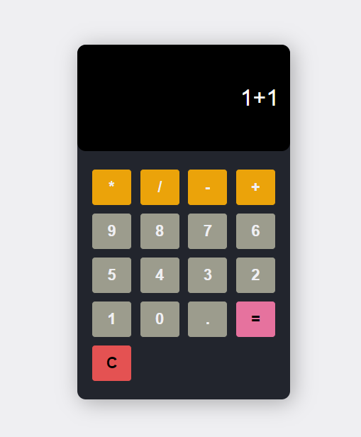

# minicalc



A simple calculator web application built using HTML, CSS, and JavaScript.

## Demo

You can try out the calculator app live at [Demo Link](https://example.com/calculator).

## Features

- Basic arithmetic operations: addition, subtraction, multiplication, and division.
- Clear button to reset the calculator.
- Responsive design for various screen sizes.

## Installation

1. Clone this repository to your local machine using:

   ```bash
   git clone https://github.com/yourusername/calculator-app.git
